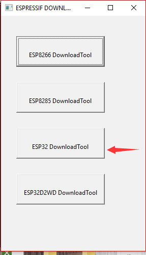
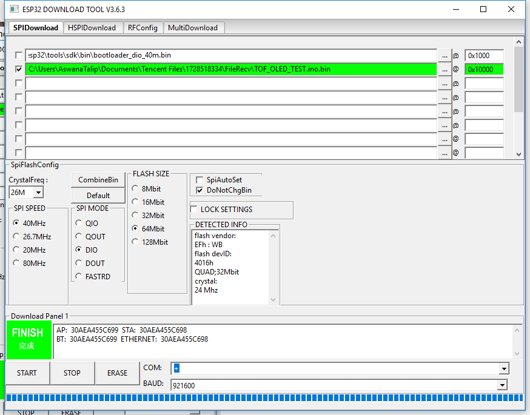

# Instructions

Use the ESP32 Tool to test your code. 

Upload the TOF_OLED_TEST.ino and run the tool. 

This tool is use to test your hardware. If your hardware is working after using this tool then there is a problem with your software configuration.
